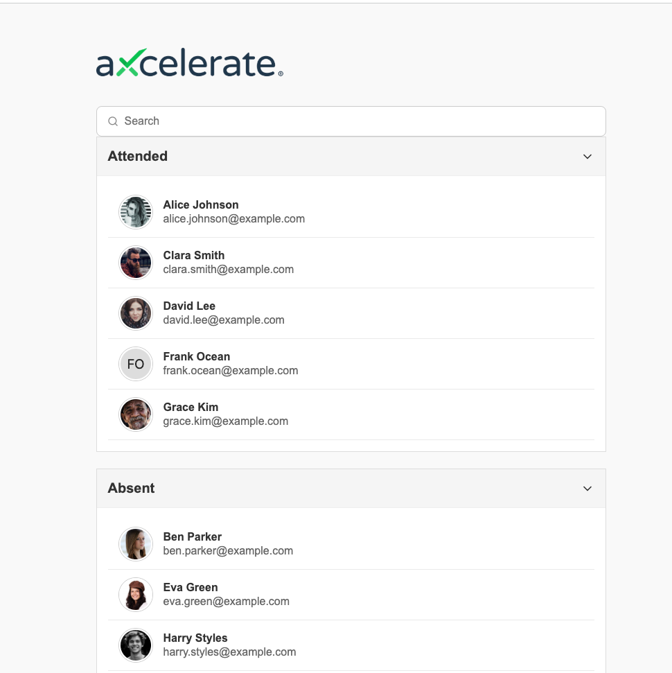
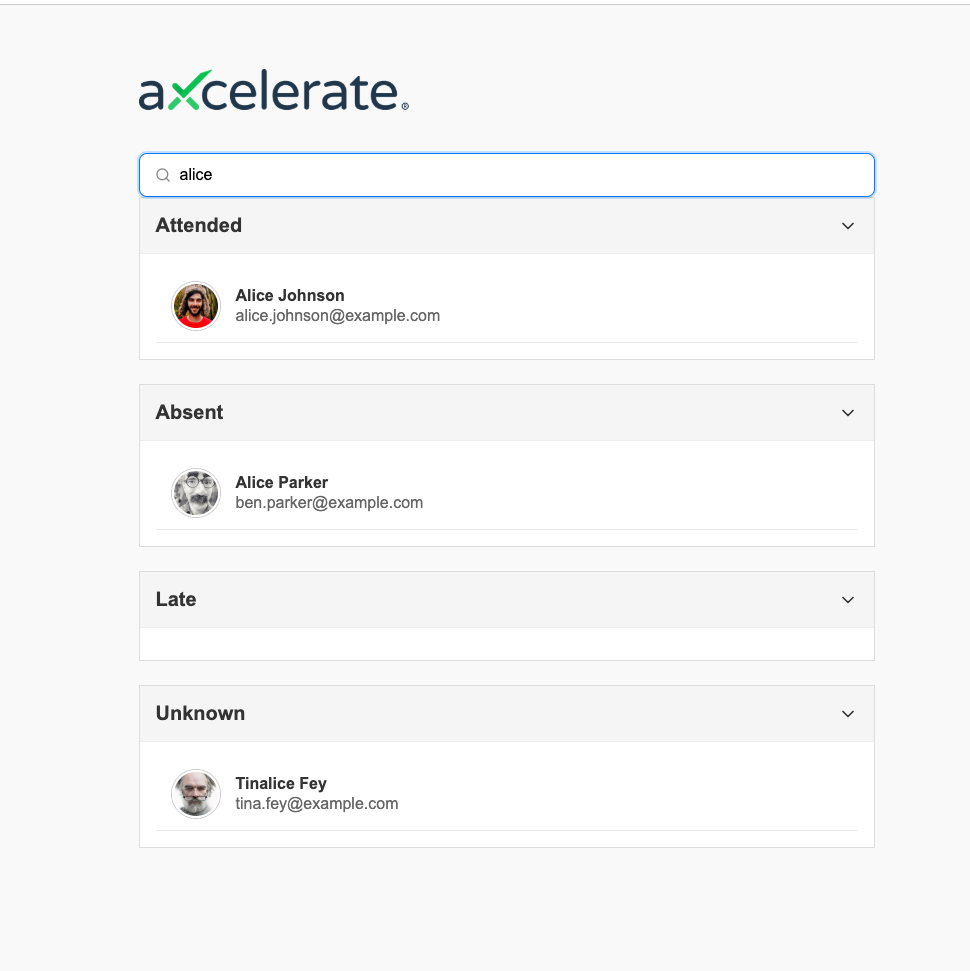

# Axcelerate Coding Challenge

A React project demonstrating reusable components including a collapsible section list, searchable lists, and student list items — all with TypeScript, Storybook documentation, and unit tests.

<p float="left">
  
  
</p>

### 🔍 Features

- **Reusable Search Field**  
  A versatile search field component that can be used anywhere in the application for search functionality.

  - Built-in **debounce mechanism** to prevent unnecessary calls during rapid user input.
  - Easily configurable for different use cases.

- **Reusable Collapsible Section List**  
  A flexible component designed to handle collapsible sections with any kind of list data.

  - Can be reused throughout the app for different types of grouped or categorized data.
  - Each section is collapsible/expandable for better user experience and UI organization.

- **Dynamic Sectioning Based on Attendance Status**  
  In the current implementation, the collapsible section list automatically creates sections based on a student's `AttendanceStatus`, which includes:
  - `Attended`
  - `Absent`
  - `Late`
  - `Unknown`  
    This approach makes the component extensible and easy to adapt for future data-driven grouping.

### 🚀 Tech Stack

- **React 19** — UI Library
- **TypeScript** — Static type checking
- **Styled-components** — CSS-in-JS styling
- **Vite** — Frontend tooling and dev server
- **Jest** — JavaScript testing framework
- **jest-in-case** — Parameterized test cases
- **React Testing Library** — Testing utilities for React components
- **Storybook 8** — Component documentation and development environment
- **ESLint** — Code linting and style checking
- **Playwright** — End-to-end testing (optional)
- **Chromatic** — Storybook publishing and visual testing

---

## Getting Started

### Prerequisites

- Node.js (>=14)
- npm (recommended) or yarn package manager

---

## Installation

1. Clone the repository

```bash
git clone https://github.com/sanjaya1996/axcelerate-coding-challenge.git
cd axcelerate-coding-challenge
```

2. Install dependencies

```bash
npm install
# or
yarn install
```

---

## Running the App

Start the development server:

```bash
npm start
# or
yarn start
```

Open [http://localhost:5173](http://localhost:5173) or the URL shown in your terminal to view the app in your browser.

---

## Running Tests

Run unit tests with Jest:

```bash
npm test
# or
yarn test
```

---

## Storybook Documentation

View the component documentation and interactive examples in Storybook:

```bash
npm run storybook
# or
yarn storybook
```

Then open [http://localhost:6006](http://localhost:6006) or the URL shown in your terminal in your browser.

---

## 📁 Folder Structure

The project follows a modular and scalable folder structure for clarity and maintainability:

```text
src/
├── components/                          # Reusable UI components
│   └── ComponentName/                   # Each component has its own folder
│       ├── ComponentName.tsx            # Component implementation
│       ├── ComponentName.styles.ts      # Styled-components or style module
│       ├── ComponentName.stories.tsx    # Storybook stories for the component
│       └── ComponentName.test.tsx       # Unit tests for the component

├── data/                                # Static or mock data
│   └── students.ts                      # Example student data

├── helpers/                             # Utility functions and helpers
│   └── array/
│       ├── index.ts                     # Array-related utility functions
│       └── index.test.ts               # Tests for array helpers

├── pages/                               # Page-level components/views
│   └── Home/
│       ├── index.tsx                    # Home page implementation
│       └── Home.styles.ts               # Styles specific to Home page
```

> 📌 **Note:** Each module is self-contained. This structure improves scalability, reusability, and testability across the project.
